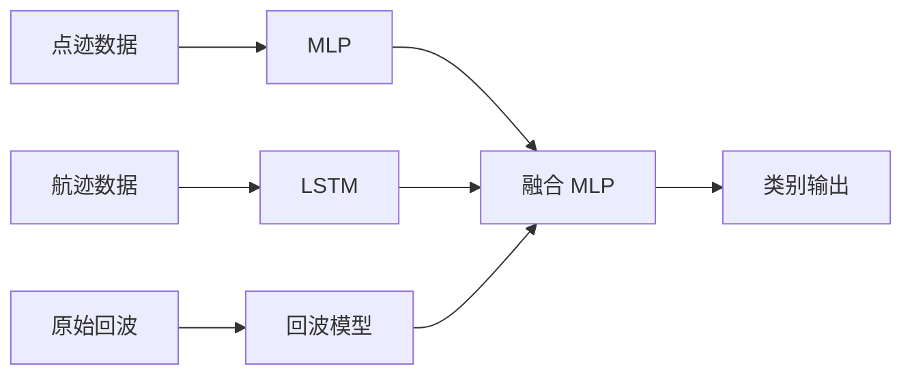

<div align="center">

# Low-Altitude Radar Multimodal Fusion

**面向低空场景的雷达多模态目标分类：点迹 · 航迹 · 原始回波特征融合**

[](https://www.python.org/)
[](https://pytorch.org/)
[](https://www.tensorflow.org/)

</div>

---

## 项目简介

在低空空域中，无人机与鸟类等目标在雷达上的可分性较差，仅依赖传统雷达处理或单一模态特征时，分类精度往往受限。本项目将 **点迹统计特征**、**航迹时序运动模式** 与 **原始回波深度表征** 三路信息结合，通过子模型分别建模，再在 **融合层** 学习联合判决，以提升目标类别区分能力。

---

## 技术路线概览

| 模态 | 含义 | 实现要点 |
|------|------|----------|
| 点迹 | 短时雷达点级统计量 | MLP（Keras） |
| 航迹 | 轨迹序列与运动特征 | LSTM（PyTorch） |
| 回波 | IQ / 帧级深度特征 | Notebook 中回波网络 + `get_radar_info` 推理 |
| 融合 | 多分支 logits / 特征拼接 | 小型 MLP（PyTorch） |



---

## 数据说明

> **重要声明**  
> 本项目所使用的雷达点迹、航迹与原始回波等数据 **受保密协议约束，无法向仓库或第三方公开**。仓库中 **不包含完整训练数据**；若需复现流程，请使用自有数据并按下文目录约定组织路径，或根据字段说明构造格式一致的替代数据。

`测试集` 等目录若保留在仓库中，仅作 **结构与小规模试验** 参考，不代表可公开数据集。

---

## 环境与依赖

    克隆仓库后，在虚拟环境中一键安装：

   ```bash
   python -m venv .venv
   .venv\Scripts\activate
   pip install -r requirements.txt
   ```


---

## 目录结构

```
project_final/
├── init_file.py                 # 将原始回波整理为 dataset/data 下按标签划分的结构
├── MLP.py                       # 点迹特征 + MLP 训练
├── LSTM.py                      # 航迹序列 + LSTM 训练
├── 雷达回波数据处理.ipynb        # 回波可视化与回波模型相关流程
├── get_radar_info.py            # 读回波 .dat、回波模型推理与 logits
├── make_three_fusion_data.py    # 生成融合训练表 train_fusion_csv/
├── three_fusion_model.py        # 融合 MLP 训练
├── predictor_three_fusion.py    # 融合模型端到端预测（需配置测试路径）
├── requirements.txt             # Python 依赖列表
├── 训练流程.md                  # 中文步骤说明（与 README 互补）
├── dataset/                     # 数据目录（完整数据需自备，见上文声明）
├── model/                       # 各阶段权重与 scaler（大文件建议 .gitignore + 另行分发）
├── train_fusion_csv/            # 融合阶段生成的 CSV
└── 测试集/                      # 小规模测试用（可选）
```

---

## 推荐运行顺序

1. **数据准备**：将点迹、航迹、原始回波放入 `dataset/` 约定子目录；运行 `init_file.py` 初始化回波目录结构。  
2. **回波**：打开 `雷达回波数据处理.ipynb` 完成预处理与回波模型相关步骤。  
3. **点迹 / 航迹**：依次运行 `MLP.py`、`LSTM.py`，得到点迹与航迹子模型权重。  
4. **融合数据**：运行 `make_three_fusion_data.py` 生成 `train_fusion_csv/`。  
5. **融合训练**：运行 `three_fusion_model.py`。  
6. **预测**：在 `predictor_three_fusion.py` 中配置测试集路径后运行。

更细的步骤见 **`训练流程.md`**。

---

## 许可证

若仓库需对外展示，请自行补充 `LICENSE` 文件（如 MIT、Apache-2.0 等）并确保与数据、第三方代码许可兼容。

---

<p align="center">
  <sub>README 与 <code>requirements.txt</code> 同步维护，便于复现与协作。</sub>
</p>
